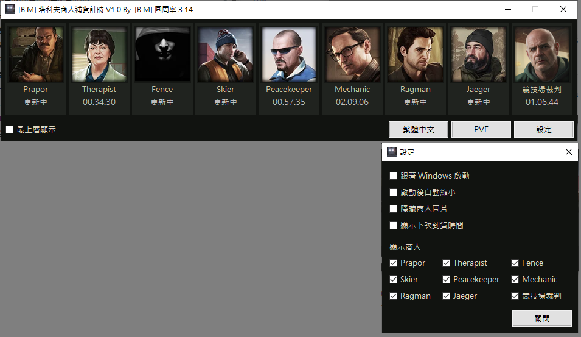

# [B.M] 塔科夫商人補貨計時

[](#系統需求)
[](https://www.python.org/)
[](https://pyinstaller.org/)
[](https://github.com/BoringMan314/bm-tarkov-trader-restock-timer)
[](LICENSE)

《逃離塔科夫》商人補貨倒數小工具：自 **tarkov.dev** 取得重設時間，支援 PvE／一般模式切換、顯示設定、系統匣與多語系介面。

*《逃离塔科夫》商人补货倒计时小工具：从 **tarkov.dev** 获取重置时间，支持 PvE／常规模式切换、显示设置、系统托盘与多语言界面。*  

*『Escape from Tarkov』向けのトレーダー補充カウントダウンツール。**tarkov.dev** からリセット時刻を取得し、PvE／レギュラーモードの切替、表示設定、システムトレイ、多言語 UI に対応。*  

*Escape from Tarkov trader restock countdown helper: fetches reset times from **tarkov.dev**, with PvE/regular mode switching, display options, tray integration, and multilingual UI.*

> **聲明**：本專案為第三方非官方輔助工具，與遊戲開發商無關；資料來自公開 API，請自行遵守遊戲與平台使用條款。

---



---

## 目錄

- [功能](#功能)
- [系統需求](#系統需求)
- [安裝與打包](#安裝與打包)
- [檢查流程（建議）](#檢查流程建議)
- [本機開發與測試](#本機開發與測試)
- [技術概要](#技術概要)
- [專案結構](#專案結構)
- [設定檔與多語系](#設定檔與多語系)
- [隱私說明](#隱私說明)
- [授權](#授權)
- [問題與建議](#問題與建議)

---

## 功能

- 自 **GraphQL**（`api.tarkov.dev`）讀取商人補貨／重設相關時間並顯示倒數。
- **遊戲模式**：`pve`（PvE）與 `regular`（一般）可於設定中切換並寫入設定檔。
- 可調整：**跟著 Windows 啟動**、**啟動後自動縮小**、**最上層顯示**、**隱藏商人圖片**、**顯示下次到貨時間**、**顯示／隱藏各商人**。
- 內建語言：繁體中文、簡體中文、日本語、English；**可**在設定檔根層 `languages` **新增**其他語系代碼。**每一**語系物件的**鍵集合**（含巢狀 **`trader_names`** 之 slug 與字串）須與 `main.py` 內建 **`default_config()["languages"]["zh_TW"]`** **完全一致**，缺一即驗證失敗，程式會刪除壞檔並寫入內建預設。
- 系統匣：
  - 左鍵預設動作可還原主視窗至約 `100,100` 並置前
  - 右鍵選單：關於、離開（鍵名 `about`、`exit`；隱藏預設動作文案鍵名 `tray_restore`）
- 防多開：後開透過 Mutex + Named Pipe 通知前開靜默退出（含 EXE 改名／複製情境）。

---

## 系統需求

- **Windows 10+**（一般使用專案根目錄的 `bm-tarkov-trader-restock-timer.exe`）。
- **Windows 7** 請使用專案根目錄的 **`bm-tarkov-trader-restock-timer_win7.exe`**；執行前請完成下方〈Win7 執行前必要環境〉（細節與疑難排解見 `README-WIN7.txt`）。
- 開發／**Win10 鏈**打包需本機 **Python 3.10+**；**Win7 鏈**打包需本機 **Python 3.8.x**。
- 需可連線至 **api.tarkov.dev**（HTTPS）以更新時間。

### Win7 執行前必要環境

- Windows 7 SP1。
- 安裝系統更新：`KB2533623`、`KB2999226`（Universal CRT）。
- 安裝 **Microsoft Visual C++ Redistributable 2015–2022**（x86／x64 依系統選擇）。
- 若啟動仍出現缺少 `api-ms-win-core-*.dll`，請依 `README-WIN7.txt` 核對更新與執行檔版本後再試。

---

## 安裝與打包

### 安裝（使用 Releases）

1. 下載 [Releases](https://github.com/BoringMan314/bm-tarkov-trader-restock-timer/releases) 的 `bm-tarkov-trader-restock-timer.exe`（Win7 請用 `bm-tarkov-trader-restock-timer_win7.exe`）。
2. 放到任意資料夾後直接執行。
3. 首次執行會在同目錄建立 `bm-tarkov-trader-restock-timer.json`。

### Windows 7

```bat
build_win7.bat
```

輸出（專案**根目錄**）：

- `bm-tarkov-trader-restock-timer_win7.exe`

### Windows 10/11

```bat
build_win10.bat
```

輸出（專案**根目錄**）：

- `bm-tarkov-trader-restock-timer.exe`

### Windows（雙工具鏈：Win10/11 + Win7）

```bat
build_win10+win7.bat
```

輸出（專案**根目錄**）：

- `bm-tarkov-trader-restock-timer.exe`
- `bm-tarkov-trader-restock-timer_win7.exe`

說明：

- `build_win10.bat`／`build_win7.bat` 會呼叫 **`build.py win10`** 或 **`build.py win7`**，由 PyInstaller **onefile** 建置；先輸出至 `dist\`，再將 exe **搬移到專案根目錄**，並清空 `build`／`dist` 內容。
- `bm-tarkov-trader-restock-timer.exe`：使用 `requirements-win10.txt`（Python 3.10+）。
- `bm-tarkov-trader-restock-timer_win7.exe`：使用 `requirements-win7.txt`（**僅** Python 3.8.x 建置）。
- 在 Win7 上請執行 `bm-tarkov-trader-restock-timer_win7.exe`，不要執行 Win10 鏈產物。
- 打包前需已存在 `icons\icon.ico`（及建置時一併打包之 `icons` 資源）。

---

## 檢查流程（建議）

1. 啟動後主視窗是否出現於第一螢幕約 `100,100`。
2. 網路正常時，倒數或「更新中」狀態是否會向 **tarkov.dev** 取數並更新。
3. 設定內切換 **PvE／一般**、勾選商人顯示等是否生效並寫回 JSON。
4. 語言按鈕循環、`bm-tarkov-trader-restock-timer.json` 讀寫是否正常（**每個**語系區塊鍵集與 **`trader_names`** 須與內建 `zh_TW` 一致，否則會覆寫為預設）。
5. 系統匣左鍵預設動作能否還原視窗；右鍵「關於」「離開」是否正常。
6. 連續啟動兩次是否僅保留最後一個實例。
7. 勾選／取消「跟著 Windows 啟動」後，目前使用者 Run 機碼是否相符。

---

## 本機開發與測試

```bash
python -m pip install -r requirements-win10.txt
python main.py
```

（僅維護 Win7 鏈時，請改用 Python 3.8 並安裝 `requirements-win7.txt`。）

---

## 技術概要

- GUI：`tkinter`／`ttk`
- 資料來源：`urllib` 呼叫 **tarkov.dev** GraphQL API
- 系統匣：`pystray` + `Pillow`
- 置頂與視窗：Win32（`ctypes`）
- 開機啟動：`winreg`（目前使用者 Run）
- 防多開：`bm_single_instance.py`（Mutex `Global\bm-tarkov-trader-restock-timer` + Named Pipe）
- 打包：`PyInstaller`（由 `build.py` 呼叫；`--version-file version_info.txt`）
- 設定檔：EXE 同層 `bm-tarkov-trader-restock-timer.json`（Win10／Win7 exe 共用）

---

## 專案結構


| 路徑                            | 說明                              |
| ----------------------------- | ------------------------------- |
| `main.py`                      | 主程式（UI、API、設定、系統匣、防多開）         |
| `bm_single_instance.py`        | 單一實例（Mutex／Named Pipe）         |
| `build_win7.bat`               | Win7 單檔打包（最終 exe 於專案根目錄）          |
| `build_win10.bat`              | Win10 單檔打包（最終 exe 於專案根目錄）         |
| `build_win10+win7.bat`         | 依序呼叫上兩者                        |
| `build.py`                     | PyInstaller 建置腳本（`win10`／`win7`）   |
| `version_info.txt`             | Windows exe 檔案版本資源               |
| `requirements-win10.txt`       | Win10/11 打包用 Python 相依套件       |
| `requirements-win7.txt`        | Win7 打包用 Python 相依套件         |
| `README-WIN7.txt`              | Win7 執行環境（KB／VC++）說明          |
| `icons/`                       | 圖示（`icon.ico` 等）               |
| `screenshot/`                  | README 展示截圖（選用）                 |


---

## 設定檔與多語系

- 設定檔：`bm-tarkov-trader-restock-timer.json`（與 exe 同層）。
- 根層 **`settings`**：`languages`（目前 UI 語系，且須為 `languages` 內已存在之鍵）、`game_mode`（`pve`／`regular`）、`visible_traders`（每位商人 slug 對應 bool）、`auto_start`、`auto_minimize`、`always_on_top`、`hide_trader_images`、`show_next_arrival` 等，見 `main.py` 之 `default_config()`／`is_valid_config()`。
- **內層嚴格**：根層 `languages` 底下**每一個**語系物件的**鍵集合**須與 **`default_config()["languages"]["zh_TW"]`** **完全相同**；其中 **`trader_names`** 之子鍵須與內建九位商人 **slug**（`prapor`、`therapist`、`fence`、`skier`、`peacekeeper`、`mechanic`、`ragman`、`jaeger`、`ref`）**完全一致**，且各值為非空字串。**不可**只填部分鍵指望程式補齊；驗證失敗時會刪除壞檔並寫入內建預設。
- **外層可擴**：語系代碼數量**不**限於四個；循環順序為內建四語（實際存在之鍵）後接自訂代碼，依 JSON 出現序。
- 視窗標題產品名僅使用 **`project_name`**；系統匣選單使用 **`tray_restore`**（隱藏預設動作）、**`about`**、**`exit`**。

在既有設定檔的 `languages` 中**新增**一個語系時，請貼上**完整**區塊（含 **`trader_names`**）。以下為**可直接使用**的韓文範例（鍵名與巢狀結構與內建 `zh_TW` 對齊）：

```json
"ko_KR": {
  "language_name": "한국어",
  "project_name": "타르코프 상인 리스톡 타이머",
  "settings": "설정",
  "settings_button": "설정",
  "settings_title": "설정",
  "autostart_checkbox": "Windows 시작 시 실행",
  "auto_minimize_checkbox": "시작 시 최소화",
  "hide_trader_images_checkbox": "상인 이미지 숨기기",
  "always_on_top_checkbox": "항상 위에 표시",
  "show_next_arrival_checkbox": "다음 입고 시간 표시",
  "traders_visibility_title": "표시할 상인",
  "settings_close": "닫기",
  "next_arrival_prefix": "다음 입고",
  "countdown_updating": "업데이트 중",
  "tray_restore": "복원",
  "about": "정보",
  "exit": "종료",
  "trader_names": {
    "prapor": "Prapor",
    "therapist": "Therapist",
    "fence": "Fence",
    "skier": "Skier",
    "peacekeeper": "Peacekeeper",
    "mechanic": "Mechanic",
    "ragman": "Ragman",
    "jaeger": "Jaeger",
    "ref": "아레나 심판"
  }
}
```

並將 `settings.languages` 設為 `ko_KR`（若要以韓文啟動）。併入後請確認 JSON 仍符合上述**鍵集全等**規則。

---

## 隱私說明

本工具為本機端執行程式，預設僅在本機讀寫同目錄設定檔（`*.json`），**不蒐集、不上傳**帳號密碼或遊戲登入資料。

對外連線包含：

- 向 **`https://api.tarkov.dev/graphql`** 查詢公開遊戲資料（商人相關時間），以更新畫面顯示。
- 使用者在系統匣選單點擊「關於」時，可能開啟 `http://exnormal.com:81/`（失敗時靜默處理）。
- 使用者自行透過 GitHub 下載、更新或回報 Issue 時，會依 GitHub 平台規則產生對應網路請求。

---

## 授權

本專案以 [MIT License](LICENSE) 授權。

---

## 問題與建議

歡迎使用 [GitHub Issues](https://github.com/BoringMan314/bm-tarkov-trader-restock-timer/issues) 回報錯誤或提出建議（請附上系統版本、重現步驟、錯誤訊息）。
